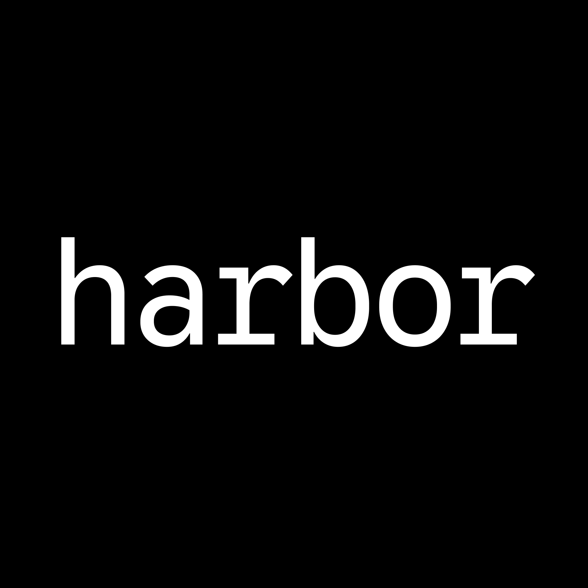
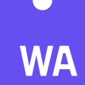

<!-- prettier-ignore -->
<div align="center">

# SharpeArena

### A deterministic trading-agent evaluation sandbox and reinforcement-learning environment

Build and train through Rust or Python, run baselines and replay trajectories in
Node, or connect an agent in any language through the JSON contract.

[](https://crates.io/crates/sharpearena)
[](https://www.npmjs.com/package/@general-liquidity/sharpearena)
[](https://pypi.org/project/sharpearena/)
[](https://docs.rs/sharpearena)
[](https://github.com/general-liquidity/sharpearena/actions)
[](LICENSE-MIT)
[](docs/architecture.md)

**[Quick start](#quick-start) · [Surfaces](#choose-a-surface) · [How the suite fits](#how-the-sharpe-suite-fits) · [Guarantees](#what-the-environment-guarantees) · [Documentation](#documentation)**

</div>

---

SharpeArena owns the trajectory-producing half of the Sharpe suite. It gives an
agent a point-in-time `Observation`, validates the returned `Decision`, advances
one frozen market step, and records enough state to replay the result. The
sibling [SharpeBench](https://github.com/general-liquidity/sharpebench) product
scores that trajectory for luck, significance, reliability, and process
discipline.

> [!IMPORTANT]
> SharpeArena makes future data unavailable at the environment boundary. It is
> not a process sandbox. Run trusted local code here, or use SharpeBench's
> digest-pinned `--image` path when an entrant needs container isolation.

## Quick start

### Python

`pip install sharpearena` gives you the Rust-backed engine plus Gymnasium, the
scalar and vector environment, and the registered difficulty IDs. It is one
route among several over the same engine; see
[Choose an interface](#choose-an-interface) for PettingZoo, `verifiers`,
Minari, MCP, and the JSON agent contract.

```bash
pip install sharpearena
```

```python
import sharpearena

env = sharpearena.SharpeArenaEnv(n_symbols=4, n_days=120, seed=1)
observation, info = env.reset(seed=1)
observation, reward, terminated, truncated, info = env.step(
    env.action_space.sample()
)
```

Difficulty and held-out bands are also registered with Gymnasium:

```python
import gymnasium
import sharpearena

env = gymnasium.make("SharpeArena/Hard-v1")
vector_env = gymnasium.make_vec("SharpeArena/Hard-v1", num_envs=8)
```

### Rust

```bash
cargo add sharpearena
```

```rust
use sharpearena::{Agent, BuyAndHold, CostModel, Dataset, TradingEnv, Window};

let data = Dataset::synthetic(4, 120, 1);
let mut env = TradingEnv::new(
    data,
    Window { start: 20, end: 120 },
    CostModel::default(),
    7,
);
let mut agent = BuyAndHold;
let mut observation = env.reset();

loop {
    let decision = agent.decide(&observation);
    let step = env.step(decision);
    observation = step.observation;
    if step.done {
        break;
    }
}
```

### JavaScript / TypeScript

```bash
npm install @general-liquidity/sharpearena
```

```ts
import { runBaseline } from "@general-liquidity/sharpearena";

const run = runBaseline({
  agent: "momentum",
  dataset: { synthetic: { n_symbols: 4, n_days: 120, seed: 1 } },
  seed: 7,
});
console.log(run.returns.length, run.cost);
```

## Choose a surface

| Surface | Install | Best for |
|:--|:--|:--|
| Rust | `cargo add sharpearena` | The deterministic environment, scenario generation, vector stepping, execution, market clearing, and governed wire contract. |
| Python | `pip install sharpearena` | Gymnasium and the scalar/vector environment, plus optional extras for PettingZoo, `verifiers`, Minari, MCP, and local-model tooling. See [Choose an interface](#choose-an-interface). |
| npm | `npm i @general-liquidity/sharpearena` | Named baselines, synthetic data, replay, stress suites, walk-forward windows, and regime tags under Node or Bun. |
| JSON contract | stdin/stdout or `POST /decide` | The observation/decision protocol for an external runner; not a standalone Arena CLI. |

Package-specific usage lives beside each distribution: the
[Rust crate](crates/sharpearena/), [Python package](crates/sharpearena-py/), and
[npm package](npm/sharpearena/).

## Choose an interface

The Python package is the surface above; underneath it, several interfaces sit
over the same engine, and Gymnasium is one of them, not the only one. Four are
optional extras (`pip install "sharpearena[pettingzoo,verifiers,minari,mcp]"`).
A short, runnable example for every row below except Gymnasium (see
[Quick start](#quick-start)) is in [the interface examples](docs/interfaces.md).

| Interface | What it's for |
|:--|:--|
|  Gymnasium (scalar and vector) | The default Python route: `SharpeArenaEnv`, `SharpeArenaVectorEnv`, registered `SharpeArena/<Tier>[-Eval]-v1` IDs. |
|  PettingZoo | Multi-agent parallel envs: shared-market impact and the limit-order book. |
|  `verifiers` / Prime-RL | RLVR-style multi-turn rollout with an XML decision parser, for training with Prime-RL. |
|  Minari | Offline-RL dataset export, including a train/test split. |
| <a href="https://modelcontextprotocol.io"></a> MCP | An MCP server for connecting an agent over that protocol. |
| JSON contract | stdin/stdout or `POST /decide`, for an external agent in any language; not a standalone Arena CLI. |
|  HUD | A task and grader for the HUD agent SDK, exercised locally with a deterministic agent double: `examples/hud/`. |
|  Harbor | A Harbor task package with a separate-container verifier and tampering fixtures: `integrations/harbor/`. |
| SharpeBench bridge | Compiles episode evidence into the inputs the benchmark scores: `bench_bridge.py`. |
| Functional view | A replay interface over recorded history, not an accelerator-native engine: `functional.py`. |
|   WASM and TypeScript | The same engine compiled for JavaScript runtimes: `crates/sharpearena-wasm/`. |

Each row's actual test coverage differs; none of them has been used to produce
a reported benchmark result yet. The
[support status table](docs/integrations/support-status.md) states, per
interface, what is contract-tested, what is only specified, and what is not
supported (CleanRL, Ray and RLlib, Stable-Baselines3, TorchRL) or ruled out
(PufferLib, EnvPool), with the evidence for each. The HUD and Harbor routes
are local feasibility work rather than supported integrations: each ran on one
host with a deterministic agent and no model call, and each records what its
evidence does not cover. Read
[the integration inventory](docs/integrations/inventory.md) for what exists
and where, and [the contract map](docs/integrations/contracts.md) for which
module owns each contract clause.

Every interface above with an upstream project of its own carries that project's
logo. The three without one, the JSON contract, the SharpeBench bridge and the
functional view, have no third party behind them to credit. A logo says who
built the thing this package talks to, and nothing about how far that route is
supported here, which the column beside it and the support-status table state in
words. [`docs/assets/logos/`](docs/assets/logos/) records where each file came
from and what governs its use. Each project is its own trademark holder, and
none of them endorses this one.

## How the Sharpe suite fits

```text
agent (any language)
        │ Observation → Decision
        ▼
SharpeArena
  point-in-time scenario · execution · process trace · effective config
        │ validated, append-only field artifact
        ▼
SharpeBench
  deflation · pass^k · significance · process/mandate gates · attestation
```

The relationship is directed, not cyclic. SharpeArena uses the small published
SharpeBench protocol, simulator, and scoring crates so both products share one
execution model. SharpeBench does not depend on the full SharpeArena package.
`sharpearena-compile-bench` refuses incomplete grids, failed cells, coordinate
collisions, conflicting completions, and invalid return hashes before producing
ordinary SharpeBench submissions. Its companion manifest preserves validated
per-request latency, token, reasoning-token, and retry summaries as a
rank-neutral operational profile. Those diagnostics describe how a field ran;
they cannot change a SharpeBench score or eligibility verdict.

## What the environment guarantees

- **Point-in-time access:** the environment owns the cursor and exposes no
  future-bar API. Causal wrappers and `LookaheadGuard` preserve that boundary.
- **Failure is not a hold on checked field paths:** malformed output, transport
  loss, timeouts, and invalid symbols become typed failed cells rather than
  scoreable empty decisions. Low-level unchecked backtests remain available for
  compatibility and do not make that guarantee.
- **Replay from decisions:** returns and score inputs are recomputed from recorded
  decisions and frozen inputs rather than trusted from an agent. Step labels and
  observation IDs are evidence metadata, not replay inputs.
- **Known arm identity:** evidence producers compare requested configuration
  with values read back from the environment that consumed it.
- **Operational accounting without rank leakage:** local-field evidence records
  every model-call duration and its observation source; bridge manifests report
  nearest-rank p50/p95 latency, token totals, reasoning-token availability, and
  retries with `rank_input: false`.
- **Cross-surface compatibility:** canonical pre-hash JSON, native/WASM/npm/
  Python parity tests, and `SPEC_HASH` turn wrapper/engine drift into a refusal.
- **Closed inputs:** schemas, typed boundary errors, unknown-field rejection,
  and path-containment checks prevent ambiguous caller input.
- **Reproducible releases:** provenance binds source and evidence; package smoke
  tests install the built wheel and npm tarball outside the repository.

Read the precise scopes and non-claims in
[Integrity and security](docs/integrity-and-security.md).

## What you can build

- single-agent and vectorized point-in-time environments;
- Gymnasium, PettingZoo, RLVR/`verifiers`, and offline-RL workflows;
- portfolio, execution, market-making, shared-impact, and limit-order-book tasks;
- procedural, held-out, sealed-seed, real-data, and regime-transfer evaluations;
- deterministic local-model fields with resumable journals and strict faults;
- append-only prospective forecasts with frozen settlement contracts and raw evidence export;
- host-counted strategy-search trials with a closed, non-executable DSL;
- a separate paper-only forward arm with deny-first risk checks and persistent
  reconciliation state.

The complete, current inventory is in the [capability map](docs/capabilities.md).

## Agent contract

An agent receives point-in-time market state and returns target-weight orders:

```json
{
  "date": "2025-01-02",
  "cash": 1.0,
  "symbols": [
    { "symbol": "AAPL", "close_history": [187.2, 188.0, 190.4] }
  ],
  "portfolio": []
}
```

```json
{
  "orders": [
    { "symbol": "AAPL", "action": "buy", "target_weight": 0.5 }
  ]
}
```

`CONTRACT_VERSION` governs additive wire evolution; JSON Schemas and
bidirectional conformance tests guard the Rust types. See the
[agent contract guide](docs/agent-contract.md),
[contract directory](crates/sharpearena/contract/), and
[governance rules](crates/sharpearena/GOVERNANCE.md).

## Current evidence

The committed paper separates two evidence strata. Historical calibration and
falsification experiments use deterministic reference policies; F1 records
package version 0.9.0, while most other historical artifacts do not serialize a
runtime version. A later, now-superseded engineering pilot sealed three
already-cached local model snapshots before 24 Binance Spot candle outcomes
existed, then resolved all contracts on exact common support. It validates the
protocol plumbing only. Its older convenience-sample checkpoints are excluded
from the paper's model evidence and from any benchmark or comparative claim.
Forecast quality cannot change trading rank. No model weights are part of the
repository or downloaded by CI.

Results, non-results, and finite-grid limits are summarized in
[Evidence and current status](docs/evidence.md). Exact commands, fixed seeds,
JSON artifacts, figures, and provenance live under [`paper/`](paper/).

> [!NOTE]
> “Leak-free” describes the point-in-time information boundary. It does not
> claim Docker/microVM containment, protection from a malicious kernel-level
> entrant, or a hosted multi-tenant service.

## Architecture

The determinism-critical path is Rust and forbids `unsafe`. Python and
TypeScript adapt the same engine to their ecosystems rather than reimplementing
the market model.

```text
sharpebench-protocol + sharpebench-sim + sharpebench-core
                         │
                  sharpearena (Rust)
                 /          |          \
        WASM / npm      pyo3 / Python   Rust API
```

See [Architecture](docs/architecture.md) for package ownership, compatibility,
effective configuration, and release topology.

## Documentation

| I want to… | Read |
|:--|:--|
| Understand the package and trust boundaries | [Architecture](docs/architecture.md) · [Integrity and security](docs/integrity-and-security.md) |
| See the full feature inventory | [Capability map](docs/capabilities.md) |
| Interpret the current results honestly | [Evidence and current status](docs/evidence.md) · [`EVALUATION.md`](EVALUATION.md) |
| Train an agent | [Gymnasium guide](docs/gymnasium.md) · [Training guide](docs/training.md) |
| Connect an external agent | [Agent contract](docs/agent-contract.md) |
| Check what's tested, specified, or ruled out per interface | [Support status](docs/integrations/support-status.md) |
| Commit and export prospective forecasts | [Prospective forecast evidence](docs/forecast-evidence.md) |
| Run local open-weight models | [Local-agent architecture](docs/LOCAL_AGENT_ARCHITECTURE.md) · [Model matrix](docs/LOCAL_MODEL_MATRIX_2026.md) |
| Operate or publish a release | [`RELEASING.md`](RELEASING.md) |
| Browse everything | [Documentation map](docs/README.md) |

---

<div align="center">
<sub>Produce the trajectory here. Prove the edge in SharpeBench.</sub>
</div>
