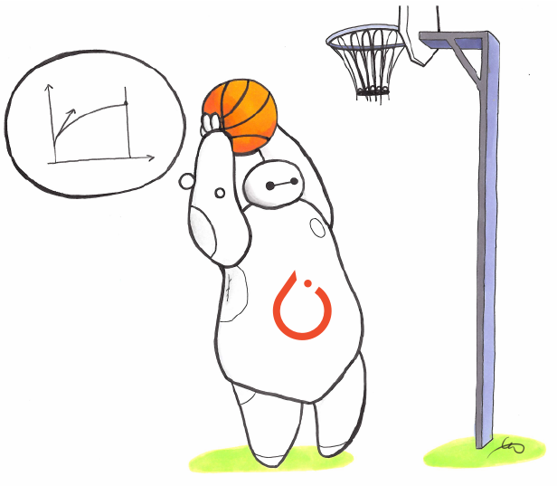

# Integration inventory and version matrix (INT-00)

What the tree actually contains on `b9fdf30`, read against the integration plan's
claims rather than assumed from them. Every row below was checked against the source
file named in it. Nothing is listed as missing that was not grepped for first. The
original pass was checked against `d33b249`; this update reread every row against the
current commit rather than trusting the earlier one, and the one row that had gone
stale (HUD and Harbor, below) is corrected.

## What already exists

| Ecosystem | Present | Where | Upstream import |
|---|---|---|---|
| <picture><source media="(prefers-color-scheme: dark)" srcset="../assets/logos/gymnasium-dark.svg"></picture> Gymnasium scalar | Yes | `crates/sharpearena-py/python/sharpearena/gym.py` (`SharpeArenaEnv`) | Hard; `gymnasium>=1.0` is a base dependency |
| <picture><source media="(prefers-color-scheme: dark)" srcset="../assets/logos/gymnasium-dark.svg"></picture> Gymnasium vector | Yes | `vector.py` (`SharpeArenaVectorEnv` over native `VecTradingEnv`) | Hard, with a guarded `AutoresetMode` import that falls back to the string label |
| <picture><source media="(prefers-color-scheme: dark)" srcset="../assets/logos/gymnasium-dark.svg"></picture> Gymnasium wrappers | Yes | `wrappers.py`, `wrappers_vector.py`, `spaces.py` | Hard |
| <picture><source media="(prefers-color-scheme: dark)" srcset="../assets/logos/gymnasium-dark.svg"></picture> Gymnasium registration | Yes | `registration.py`, IDs `SharpeArena/<Tier>[-Eval]-v1` with scalar and vector entry points | Hard |
| Conformance checker | Yes | `check_env.py` (`check_env`, `check_determinism_across_constructors`) | None; hand written, numpy only |
| <picture><source media="(prefers-color-scheme: dark)" srcset="../assets/logos/pettingzoo-dark.svg"></picture> PettingZoo | Yes | `pettingzoo_env.py`, `lob_env.py`, `market_env.py` | Guarded; `ParallelEnv` falls back to `object` and construction raises a named error |
| <picture><source media="(prefers-color-scheme: dark)" srcset="../assets/logos/minari-dark.svg"></picture> Minari | Yes | `minari_export.py` (`to_minari`, `to_minari_train_test`, `seed_band_metadata`) | Guarded behind `_require_minari()` |
| <picture><source media="(prefers-color-scheme: dark)" srcset="../assets/logos/prime-intellect-dark.png"></picture> verifiers / Prime-RL | Yes | `verifiers_env.py`, `examples/prime-rl/` | Guarded; the class only exists when `verifiers` imports |
| SharpeBench bridge | Yes | `bench_bridge.py` | Standard library only |
| <a href="https://modelcontextprotocol.io"><picture><source media="(prefers-color-scheme: dark)" srcset="../assets/logos/mcp-dark.svg"></picture></a> MCP | Yes | `mcp_server.py` | Guarded behind `FastMCP is None` |
| Functional view | Yes | `functional.py` (`SharpeArenaFuncEnv`) | Three-way probe ending in a local shim, so the module always imports |
| CleanRL | No | Nothing in the tree | |
|  Ray, RLlib | Yes | `ray_executor.py` (INT-06: `run_episodes`, a Ray task per episode with a deterministic, completion-order-independent reduction) and `rllib_env.py` (INT-07: `sharpearena_env_creator`, `SharpeArenaMultiAgentEnv`, single- and multi-agent PPO configs) | Guarded; both modules import with no Ray installed and raise `RayUnavailable` / `RLlibUnavailable` only on construction |
| <picture><source media="(prefers-color-scheme: dark)" srcset="../assets/logos/hud-dark.svg"></picture> HUD | Yes, as a local feasibility fixture, not a supported integration | `examples/hud/`, `crates/sharpearena-py/tests/test_hud_local.py`. Only `LocalRuntime` and `SubprocessRuntime` were exercised; `DockerRuntime`, `ModalRuntime`, and `HUDRuntime` were not. Report: `docs/integrations/INT-08-hud-local-feasibility.md`. | Not imported by the package; the fixture depends on the `hud` PyPI package |
| <picture><source media="(prefers-color-scheme: dark)" srcset="../assets/logos/harbor-dark.png"></picture> Harbor | Yes, as a local feasibility fixture, not a supported integration | `integrations/harbor/` (task package, fixtures, tampering jobs). Ran on Docker Desktop over WSL2. Report: `docs/integrations/INT-09-harbor-local-feasibility.md`. | Not imported by the package; the fixture depends on the `harbor` PyPI package |
|  Stable-Baselines3 | Yes | `sb3_env.py` (`SharpeArenaSB3VecEnv` over the native batched engine, fixed at `autoreset_mode="same_step"`) | Guarded; `stable_baselines3.common.vec_env.base_vec_env.VecEnv` falls back to `object` and construction raises `SB3Unavailable` |
|  PufferLib, EnvPool | No | Nothing in the tree | |
|  TorchRL | Yes | `torchrl_env.py` (`SharpeArenaTorchRLEnv`, an `EnvBase` subclass) | Guarded; `EnvBase` falls back to `object` and construction raises `TorchRLUnavailable` |

Every row above with an upstream project of its own carries that project's logo;
see [`docs/assets/logos/`](../assets/logos/) for each file's source and the terms
governing its use. A logo credits the project this tree talks to. It is not a
support claim: the "Present" column beside it, and
[`support-status.md`](support-status.md), are where that is stated, and two of
the rows carrying a logo are local feasibility fixtures rather than supported
integrations. Rows for ecosystems this tree does not implement carry no logo.

The declared optional extras are seven: `verifiers`, `minari`, `pettingzoo`, `mcp`,
`sb3`, `torchrl`, and `ray` (`crates/sharpearena-py/pyproject.toml`). `sb3`,
`torchrl` and `ray` are each left out of `ci-requirements.txt`, and
`tests/test_sb3.py` / `tests/test_torchrl.py` / `tests/test_ray_executor.py` /
`tests/test_rllib.py` skip their extra-gated cases on CI, each for its own
reason: `sb3` and `torchrl` both pull in torch, the largest single dependency
any extra here declares; `ray[rllib]==2.58.0` pins `gymnasium==1.2.2` exactly,
which conflicts with this tree's CI pin of `gymnasium==1.3.0` in a single `pip
install --requirement` invocation (see the version matrix below). The
pure-mapping tests (the union rule, the `TimeLimit.truncated` term, the
encoding round trip) still run everywhere. `torchrl` and `ray` are
version-bounded rather than open (`torchrl>=0.14,<0.15`,
`ray[rllib]>=2.58.0,<3`): INT-06/INT-07 were checked against Ray 2.58.0's
actual behaviour rather than a floor (the Tune-registry requirement, the
Dict-observation RLModule failure, and whether multi-agent env runners
vectorise have each changed across recent Ray releases), and INT-12 similarly
against TorchRL's 0.14 `EnvBase` contract. The INT-18 installed-wheel matrix
excludes the same three extras from its own per-extra install cells, for their
own reasons rather than one shared one: see the "Installed-wheel compatibility
matrix" section below for what is and is not exercised against a built wheel
for `sb3`, `torchrl` and `ray`. The plan's warning holds: generic Gymnasium and
Farama compatibility is real and already tested, and the gap is the seven
named consumer routes, not the interfaces they consume.

### Two claims with thin test backing

`docs/capabilities.md` lists both, and both have a module behind them, so neither is a
false claim. Neither has a direct test:

- `wrappers_vector.py` (`VectorCausalNormalizeObservation`, `VectorRecordEpisodeStatistics`)
  has no test file, and no test names either class.
- `spaces.py` (`flatten_obs`, `unflatten_obs`, `flat_dim`, `FlattenObservation`) is
  exercised indirectly through `PreprocessingConfig(flatten=True)` in
  `tests/test_preprocessing.py`, and now also directly: INT-07's
  `tests/test_rllib.py` runs `FlattenObservation`'s round trip through
  `integrations.parity.check_adapter_parity` on `CORE_FIXTURES`, so the claim is
  bit-for-bit against the native engine rather than shape-only.

Both belong to INT-03, which is where the Gymnasium surface is brought to contract
coverage.

## Autoreset modes this environment supports

Gymnasium defines three, and this package supports all three. `SharpeArenaVectorEnv`
accepts `next_step`, `same_step` and `disabled` (`vector.py`), maps them onto
`gymnasium.vector.AutoresetMode` when that enum is importable, and reports the chosen
mode in `metadata["autoreset_mode"]`.

| Mode | Behaviour here | Final observation |
|---|---|---|
| `next_step` | Default. The terminal step is returned verbatim; the lane resets on the following step | None. The terminal observation is the step return itself |
| `same_step` | The lane resets in place, so the returned batch already holds the new episode's first observation | `infos["final_obs"]` and `infos["final_info"]`, object arrays with `None` for lanes that did not finish |
| `disabled` | The lane never auto-resets and stays at its terminal bar | None |

Two consequences for adapter work. The key is `final_obs`, not Gymnasium's
`final_observation`, and `wrappers_vector.py` exists because the stock vector wrappers
assume `NEXT_STEP` and assert the metadata is an `AutoresetMode` enum rather than a
string. An adapter that assumes the stock wrapper stack works unchanged under
`same_step` is wrong in both respects. The mode belongs in the recorded configuration
alongside the Gymnasium version, because learner support for it is mode dependent.

Termination and truncation are distinct here and the distinction is not the usual one:
running out of bars at the end of the point-in-time window is **truncation**, and
bankruptcy (`nav <= 0`) is **termination**, the absorbing state. A value estimate
bootstraps past the first and must not bootstrap past the second (`gym.py:243`).

## Version matrix

Two columns, because they differ and the difference matters. "CI pin" is what
`crates/sharpearena-py/ci-requirements.txt` installs. "Verified here" is what was
actually installed in the environment these INT-00 to INT-02 checks ran in; the full
suite passed under it (1893 passed, 2 skipped).

| Component | Declared floor | CI pin | Verified here |
|---|---|---|---|
| Python | `>=3.9` (`pyproject.toml`) | not pinned | 3.12.6, CPython, MSC v.1940 |
| NumPy | `>=1.21` | 2.5.3 | 2.5.1 |
| Gymnasium | `>=1.0` | 1.3.0 | 1.2.1 |
| PettingZoo | extra, unpinned | 1.27.0 | 1.26.1 |
| Minari | extra, `minari[create,hdf5]` plus `pillow` | 0.5.3 | 0.5.3 |
| h5py | via the Minari extra | 3.16.0 | 3.13.0 |
| jax / jaxlib | via the Minari extra | 0.11.1 | 0.6.1 |
| pillow | via the Minari extra | 12.3.0 | 11.2.1 |
| verifiers | extra, `>=0.3.1,<0.4` | 0.3.1 | 0.1.14 (this row only; see the INT-10 caveat below for the separate 0.3.1 pass) |
| mcp | extra, unpinned | 1.30.0 | not installed |
| pytest | not shipped | 9.1.1 | 8.4.2 |
| ray / ray[rllib] | extra, `>=2.58.0,<3` | not installed | 2.58.0 |
| torch (RLlib training only) | not declared by any extra | not installed | 2.14.0+cpu |
| OS / architecture | not constrained | Linux runners | Windows 11 26220, x86-64 (AMD64) |

`ray[rllib]==2.58.0` pins `gymnasium==1.2.2` exactly, which conflicts with this
tree's CI pin of `gymnasium==1.3.0` in a single `pip install --requirement`
invocation; the base package's own `gymnasium>=1.0` floor admits 1.2.2 and the
full 1893-test suite passed under it (recorded above as this row's evidence run),
but that pin conflict is why `ray` is not installed in CI and why
`tests/test_ray_executor.py` and `tests/test_rllib.py` are exercised locally
rather than in the pinned matrix. `torch` is needed only to actually build and
train an RLlib `AlgorithmConfig` (`AlgorithmConfig.build_algo()`); it is not part
of the `ray` extra, and `sharpearena_env_creator`, registration, and config
construction were all checked without it. See
[`docs/interfaces.md`](../interfaces.md#ray-and-rllib) for the runnable examples
and their captured output.

Caveats a later ticket must not read past:

- The Python floor is the base package's. It does not carry to any optional learner,
  and each extra needs its own range.
- INT-10 is closed: `verifiers_env.py` now states it was verified against `verifiers`
  0.3.1, matching the CI pin. The module targets 0.3.1's `verifiers.legacy` v0 API
  (`MultiTurnEnv`, `stop`/`cleanup`, `Rubric`), which 0.3.1 aliases transparently onto
  the top-level `verifiers.*` names, the same surface the module was previously
  verified against at 0.1.14, so the fix was re-verifying and re-pinning, not a
  rewrite. The 0.3.1 pass built a separate isolated venv (`verifiers==0.3.1`, plus
  `numpy`, `gymnasium`, `pytest`, `jsonschema`, but not `pettingzoo`/`minari`/`mcp`,
  which this narrower venv did not need) against this tree's already-built extension
  and ran the full `tests/` suite except `test_hud_local.py` (unrelated to `verifiers`,
  needs the separate `hud` package and Docker): 1811 passed, 65 skipped, no source
  changes, no deprecation warnings. The 65 skips are the `pettingzoo`/`minari`/`mcp`
  tests this venv could not exercise, not anything about `verifiers`; the two
  `verifiers`-specific files (`test_verifiers.py`, `test_verifiers_episode_outcomes.py`,
  82 tests) are part of that 1811. This is a separate, narrower-dependency venv from
  the one the "Verified here" column above documents (which predates this pass and
  used `verifiers` 0.1.14 among a wider set of extras), so that column keeps its
  0.1.14 value rather than implying that exact environment was rerun.
  `tests/test_verifiers.py::test_verified_version_matches_ci_pin` fails CI if the
  module's claimed version and the pin ever diverge again, and
  `UnsupportedVerifiersAPIError` (a structural capability probe, not a version-string
  check) fails loudly if a future `verifiers` release drops or reshapes that surface.
- Gymnasium's three autoreset modes exist as an enum only from 1.1. The guarded import
  in `vector.py` is what keeps 1.0 working, and a pinned combination must record the
  Gymnasium version and the mode together.
- Minari's PyPI release is 0.5.3 while 0.5.4 is tagged upstream, and their NumPy floors
  differ. Pin what is installed, not what a changelog describes.
- This table is the source-tree pin/verified split; the row above it (`Python`, "not
  pinned") is about what the source-tree `python` job installs, not the range CI holds
  the published wheel to.

### Installed-wheel compatibility matrix (INT-18)

The table above is what the source-tree suite runs against. It says nothing about the
*installed* wheel: a source checkout can shadow a broken package layout, an extra can
resolve fine in one graph and fail in another, and a guard written for "the dependency
is absent" is untested wherever every extra happens to be installed already. Three CI
jobs, generated from `crates/sharpearena-py/pyproject.toml` rather than hand-listed so
a newly declared extra gets a cell automatically, close that gap:

| Job | Covers |
|---|---|
| `wheel-install-import` | Builds the wheel with `maturin build --locked` and installs it into a clean venv outside the checkout, on the declared floor (3.9), the version the rest of CI uses (3.12), and the newest released interpreter (3.14), all on Linux; then 3.12 on macOS and Windows. Drives the native binding and the packaged Gymnasium adapter. |
| `wheel-no-extras` | Installs the bare wheel with none of the six optional extras present, asserts the base environment steps, and asserts every guarded adapter module (`pettingzoo_env`, `minari_export`, `mcp_server`, `verifiers_env`, `sb3_env`, `torchrl_env`) imports and refuses **by name** rather than dying on a bare `ImportError`. This is what makes "every adapter is guarded" a tested claim instead of an assumption read off the source, for all six declared extras including the two below that never get a `wheel-extras` cell. |
| `wheel-extras` | One cell per *installable* declared extra (`verifiers`, `minari`, `pettingzoo`, `mcp`), installing `sharpearena[<extra>]` from the built wheel and running the real adapter behind it: a PettingZoo tournament, a Minari export, the MCP tool list, the verifiers environment build. |

Representative rather than combinatorial: the interpreters between 3.9 and 3.14 differ
from each other in nothing this package touches, so the OS axis and the version axis
each get covered once rather than crossed. `scripts/optional_extras.py` is the single
registry the extras job, the no-extras job and `check-packaged-adapter.py` all read
from; `validate_coverage()` refuses to run when a declared extra has no exercise, no
recorded install-matrix exclusion, or no guard entry, so the matrix cannot quietly
shrink as the package grows and an exclusion cannot quietly rot into an accidental gap.

Two of the six declared extras, `sb3` and `torchrl`, are deliberately excluded from
`wheel-extras`: both pull torch, the heaviest dependency any extra here declares, and
`ci-requirements.txt` already excludes it from the source-tree suite for the same
reason (`tests/test_sb3.py`, `tests/test_torchrl.py` skip their torch-gated cases on
CI). Adding a `wheel-extras` cell for either would install torch a second and third
time on a matrix sized to stay near fifteen minutes. `scripts/optional_extras.py`'s
`INSTALL_MATRIX_EXCLUDED` records the reason and is checked by `validate_coverage()`
the same way `EXERCISES` is, so the exclusion cannot silently expand to cover an
unrelated future extra. What is still proven, for free, in `wheel-no-extras`: that
`SharpeArenaSB3VecEnv(...)` and `SharpeArenaTorchRLEnv(...)` refuse by name with the
dependency absent, since neither job ever installs either extra anyway. What is not
proven against an installed wheel: the real SB3 `VecEnv` / TorchRL `EnvBase` route
with the extra present.

The INT-02 tests were additionally run against an installed wheel
(`sharpearena-0.31.0-cp312-cp312-win_amd64.whl`, built from this tree) in a clean
virtual environment outside the checkout holding only NumPy 2.5.3, Gymnasium 1.3.0 and
pytest, which is the CI pin for both. All 30 passed, and the base environment imported,
reset and stepped there with no PettingZoo, Minari, verifiers or MCP installed.

## Existing parity and equivalence checkers

Four, and they check different things. INT-02 adds a fifth rather than replacing any.

| Checker | Compares |
|---|---|
| `tests/test_equivalence.py` | The batched path against B scalar envs, lane for lane, on identical actions, including under execution noise |
| `check_env.py::check_env` | One env against the Gymnasium contract plus exact reset determinism, and optionally that distinct seeds diverge |
| `check_env.py::check_determinism_across_constructors` | Two identically built envs against each other, step by step, on exact observation and reward equality |
| Cross-runtime goldens (`test_python_golden.py`, `test_wire_conformance.py`, `test_spec_hash.py`, `test_canonical_json.py`) | Python against Rust and WASM on fingerprints, wire payloads, the spec hash and canonical bytes |
| `integrations/parity.py` (new, INT-02) | The native engine against an adapter for one effective configuration and one action sequence, including refused and incomplete cases |

The gap the new one fills: nothing compared an adapter against the engine underneath
it. `test_equivalence.py` compares two adapters to each other, so a mapping error
shared by both is invisible to it. The upstream Gymnasium checkers do not verify reward
correctness, the semantics of `terminated`, info contents, action validity, episode
boundaries or autoreset, and there is no vector checker at all, so for the seven
consumer routes this is the only gate that exists.

## Handoff notes

For the branch working on RL contract coverage (`test_gym.py`, `test_vector.py`,
`test_checkpoint.py`, `test_rewards_risk_aware.py`, `test_seed_bands.py`,
`test_eval_seeds_gate.py`), which this work did not edit:

1. INT-03 should assert Gymnasium parity through `integrations.parity.check_adapter_parity`
   rather than hand rolling an engine comparison. The fixtures are in `CORE_FIXTURES`
   and take an adapter factory.
2. Fixture actions must be quantised to `float32` before use. The action space is
   `float32` while the engine takes `float64`, so an unquantised weight reaches the two
   paths as two different numbers and the difference reads as a mapping bug.
3. A parity fixture must go through the engine's resolved `(scenario, execution)` seed
   pair. `SharpeArenaEnv` splits one user seed into both; the native constructor takes
   them directly. `parity.resolved_seeds` restates the split.
4. `wrappers_vector.py` and the `spaces.py` flatten helpers are the two untested
   Gymnasium exports listed above.
